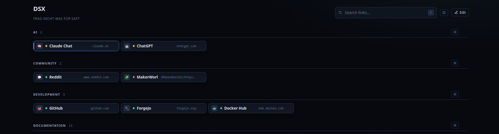
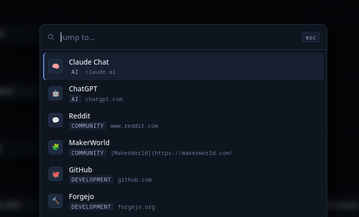
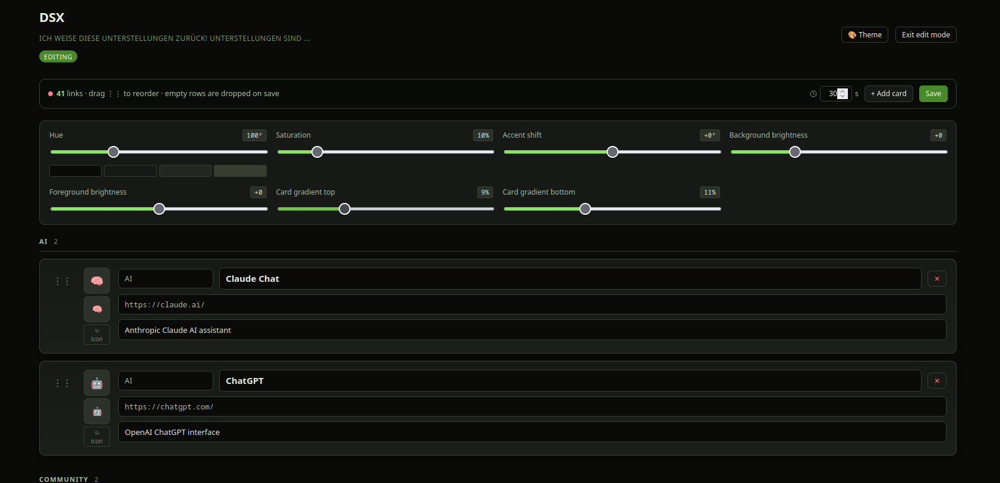
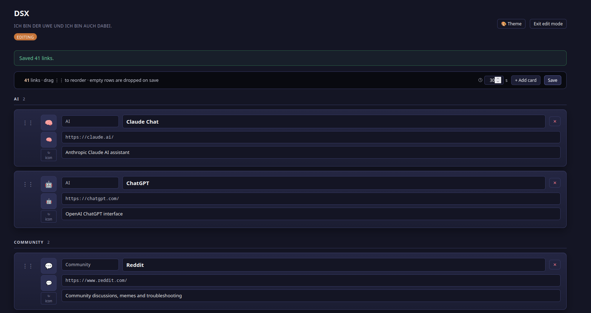

# PDashboard
Bookmark Management Tool I use as Startpage in Firefox and stuff.

Not particularly elaborate but it works.

> Uses SQLite, more than enough for thousands of bookmarks

## Features

- Editing Mode
- Theming Mode (Persistent over SQLite)
- Keyboard Shortcuts (Navigation, Search, Open in new Tab)
- Dedicated Runner with Livesearch
- Favicon fetcher
- Compact or general View
- Configurable Meme Sentences
- Reorder of Elements (Groups are to come)
- Basic Page Status check


### Base


### Runner


### Edit Mode



### Theming



## Setup

Project is installed to ```/var/www/html/dashboard/```


### Packages

```apt -y install nginx php8.4 php8.4-{fpm,curl,sqlite3}```


### Nginx Configuration


```nginx
# You can also move this line into nginx.conf
upstream php84-handler { server unix:/run/php/php8.4-fpm.sock; }

server {
  listen 443 ssl;
  http2 on;

  server_name dashboard.example.org;

  ssl_certificate certs/server.crt;
  ssl_certificate_key certs/server.key;

  error_log /var/log/nginx/dashboard.error.log info;
  access_log /var/log/nginx/dashboard.access.log;

  root /var/www/html/dashboard/public;

  location / {
    try_files $1 $uri $uri/ /index.php$is_args$args;
    index index.php;
  }

  location ~ \.php$ {
      include fastcgi_params;
      fastcgi_pass php84-handler;
      fastcgi_index index.php;
      fastcgi_param SCRIPT_FILENAME $request_filename;
      fastcgi_param REMOTE_USER $remote_user;
    }
}
```

### Permissions

Ensure the correct permissions are set

```bash
chown -R www-data:www-data /var/www/html/dashboard
find /var/www/html/dashboard -type d -exec chmod 775 {} \;
find /var/www/html/dashboard -type f -exec chmod 664 {} \;
```
